# Revisão de Código — Dynamic Risk Assessment System
### Code Review Didático para Cientistas de Dados Júnior

> **Público-alvo:** Cientistas de dados com 0–2 anos de experiência que sabem Python e pandas,
> mas estão iniciando em MLOps e desenvolvimento de software profissional.
>
> **Como usar este documento:** leia na ordem. Cada seção explica uma decisão de código,
> o *porquê* por trás dela e o que você pode levar para os seus próprios projetos.

---

## Índice

1. [Visão geral do projeto](#1-visão-geral-do-projeto)
2. [Arquitetura e fluxo do pipeline](#2-arquitetura-e-fluxo-do-pipeline)
3. [Princípios que aparecem em todo o código](#3-princípios-que-aparecem-em-todo-o-código)
4. [ingestion.py — Ingestão de dados](#4-ingestionpy--ingestão-de-dados)
5. [training.py — Treino do modelo](#5-trainingpy--treino-do-modelo)
6. [scoring.py — Avaliação](#6-scoringpy--avaliação)
7. [deployment.py — Deploy de artefatos](#7-deploymentpy--deploy-de-artefatos)
8. [diagnostics.py — Diagnóstico operacional](#8-diagnosticspy--diagnóstico-operacional)
9. [reporting.py — Relatórios](#9-reportingpy--relatórios)
10. [app.py — API Flask](#10-apppy--api-flask)
11. [apicalls.py — Cliente da API](#11-apicallspy--cliente-da-api)
12. [fullprocess.py — Orquestrador](#12-fullprocesspy--orquestrador)
13. [dbsetup.py — Persistência SQLite](#13-dbsetuppy--persistência-sqlite)
14. [Testes automatizados](#14-testes-automatizados)
15. [Checklist de boas práticas](#15-checklist-de-boas-práticas)
16. [Exercícios propostos](#16-exercícios-propostos)

---

## 1. Visão geral do projeto

Este pipeline prevê quais clientes de uma empresa têm risco de encerrar contrato (*attrition*).
É um exemplo completo de **MLOps batch**: desde a ingestão de dados até a automação de
retreino via `cron`.

```
Entrada de dados  ──▶  Treino  ──▶  Deploy  ──▶  API  ──▶  Monitoramento
  (CSV files)             │           │          (Flask)       (fullprocess)
                          │           └── artefatos em produção
                          └── modelo avaliado por F1
```

---

## 2. Arquitetura e fluxo do pipeline

### 2.1 Visão completa

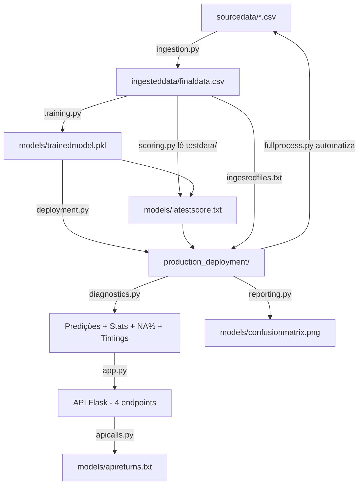

### 2.2 Fluxo de decisão do `fullprocess.py` (Step 5 — rubrica)

Este é o ponto mais importante do projeto para o revisor. O orquestrador **só reimplanta
o modelo se duas condições forem verdadeiras ao mesmo tempo**.

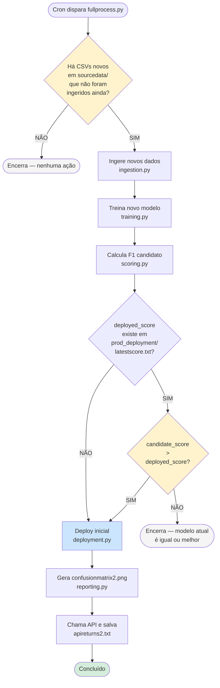

> **Por que esse fluxo é importante?**
> Sem ele, o pipeline poderia implantar automaticamente um modelo *pior* em produção.
> A regra `candidate > deployed` garante que a performance só melhora a cada redeploy.

### 2.3 Resolução de caminhos em todo o projeto

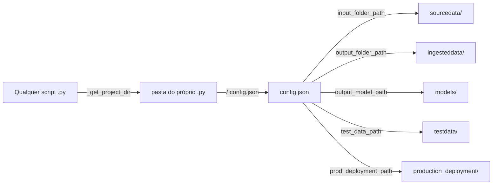

Todos os caminhos passam por um único arquivo — `config.json`. Trocar o ambiente é alterar
uma linha nesse arquivo.

---

## 3. Princípios que aparecem em todo o código

Antes de ler módulo a módulo, conheça os **4 padrões transversais** que se repetem em
todos os arquivos. Eles são decisões arquiteturais, não acidentais.

### 3.1 Config-driven paths

```python
# ❌ NÃO faça assim — caminho hard-coded
df = pd.read_csv("/home/workspace/ingesteddata/finaldata.csv")

# ✅ Faça assim — caminho vem do config
config = _load_config(project_dir)
df = pd.read_csv(project_dir / config["output_folder_path"] / "finaldata.csv")
```

**Regra:** nenhum caminho de arquivo pode aparecer como string literal no código.
Tudo passa por `config.json`.

### 3.2 Helper `_get_project_dir()`

```python
def _get_project_dir() -> Path:
    return Path(__file__).resolve().parent
```

Parece simples, mas resolve um problema sério. Compare:

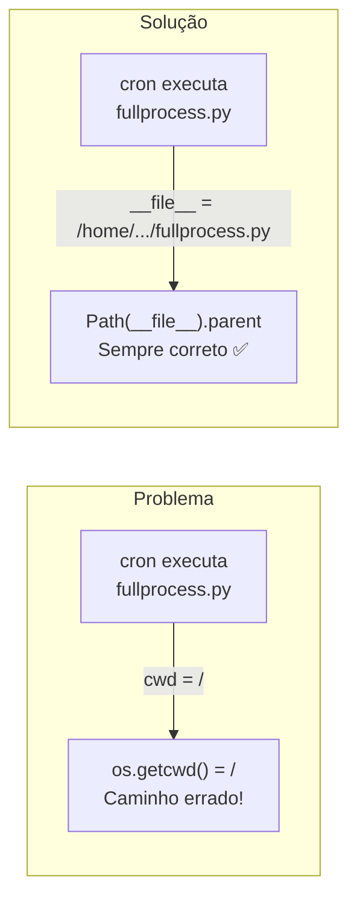

**Por que isso importa:** o `cron` executa scripts sem garantia de qual é o diretório
atual (`cwd`). `Path(__file__).resolve().parent` aponta sempre para a pasta onde está
o script — independente de quem o chamou.

**Por que isso importa para testes:** em `tests/conftest.py`, substituímos este helper
por uma função que aponta para uma pasta temporária. Isso torna os testes herméticos
(não tocam os arquivos reais do projeto).

### 3.3 `logging` em vez de `print`

```python
# ❌ Para de usar print em produção
print("Modelo treinado")

# ✅ Use logging
logger = logging.getLogger(__name__)
logger.info("Trained model written to %s", model_path)
```

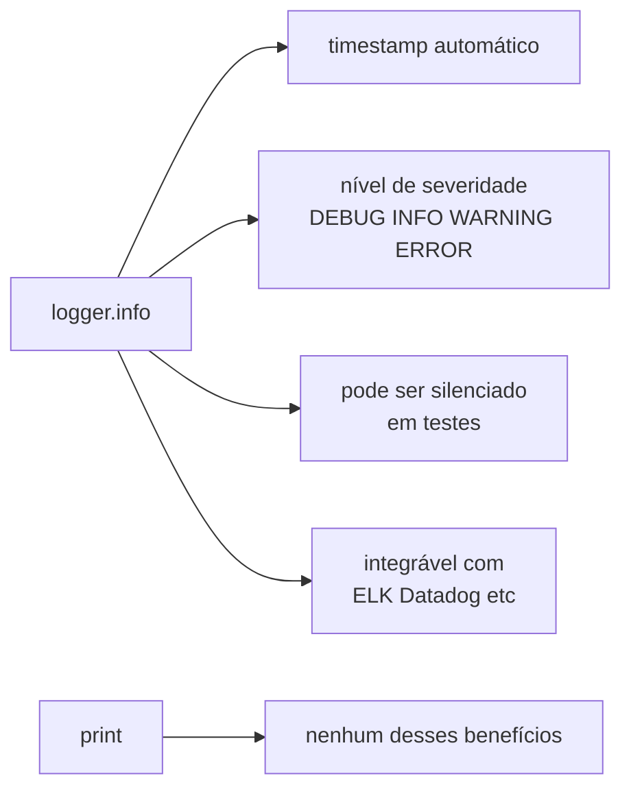

### 3.4 Separação função de domínio / `main()`

Todo script segue este padrão:

```python
# Função de domínio — testável, importável
def train_model() -> LogisticRegression:
    ...
    return model

# main() — apenas cola CLI com a função
def main() -> None:
    parser = argparse.ArgumentParser(...)
    args = parser.parse_args()
    train_model()

if __name__ == "__main__":
    main()
```

**Por que:** `fullprocess.py` importa `training.train_model()` diretamente.
Se a lógica estivesse dentro do `if __name__ == "__main__"`, essa importação
seria impossível.

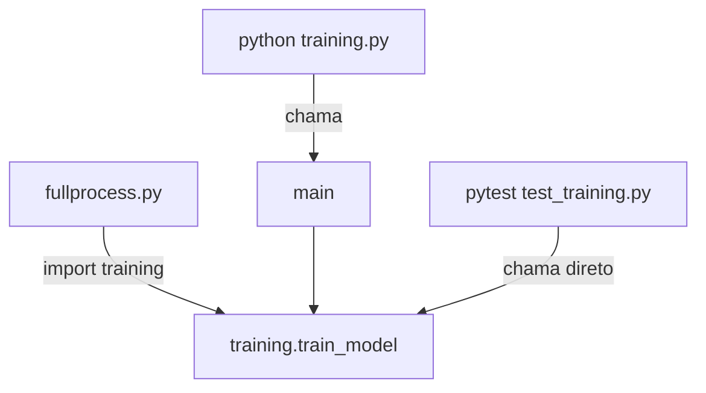

---

## 4. `ingestion.py` — Ingestão de dados

**Responsabilidade:** ler todos os CSVs de `input_folder_path`, juntar, deduplicar e
gravar `finaldata.csv` + `ingestedfiles.txt`.

### 4.1 Auto-descoberta de arquivos

```python
csv_paths = sorted(
    p for p in input_dir.iterdir()
    if p.is_file() and p.suffix.lower() == ".csv"
)
```

| Detalhe | Por quê |
|---|---|
| `iterdir()` (sem filtro fixo) | descobre qualquer CSV, sem hard-code de nomes |
| `sorted()` | garante ordem determinística → mesma entrada = mesmo output |
| `.suffix.lower()` | tolera `.CSV` maiúsculo (Windows/Excel) |

### 4.2 Fail loud, fail fast

```python
if not input_dir.exists() or not input_dir.is_dir():
    raise NotADirectoryError(f"Configured input_folder_path is not a directory: {input_dir}")

if not csv_paths:
    raise FileNotFoundError(f"No .csv files found in input folder: {input_dir}")
```

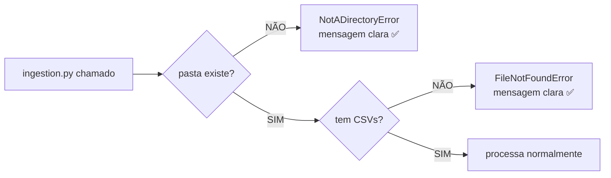

**Princípio:** prefira quebrar agora com mensagem clara do que continuar e falhar
silenciosamente três etapas depois.

### 4.3 Deduplicação

```python
merged = pd.concat(dataframes, ignore_index=True).drop_duplicates().reset_index(drop=True)
```

- `drop_duplicates()` — remove linhas idênticas (evita treinar com dados repetidos).
- `reset_index(drop=True)` — evita índices duplicados que causam bugs em operações
  posteriores.

### 4.4 Hook SQLite defensivo

```python
try:
    import dbsetup
    dbsetup.record_ingestion(len(merged), filenames)
except Exception as exc:
    logger.warning("Skipping DB history write: %s", exc)
```

> **Quando usar `except Exception` amplo:** normalmente evite — pode esconder bugs.
> Aqui é legítimo porque o SQLite é uma funcionalidade **opcional**. Se falhar,
> o pipeline principal não pode quebrar por causa disso.

---

## 5. `training.py` — Treino do modelo

**Responsabilidade:** ler `finaldata.csv`, treinar `LogisticRegression`, gravar
`trainedmodel.pkl`.

### 5.1 Colunas como constantes de módulo

```python
FEATURE_COLUMNS: List[str] = ["lastmonth_activity", "lastyear_activity", "number_of_employees"]
TARGET_COLUMN: str = "exited"
```

**Por que no topo do módulo, não dentro da função:**

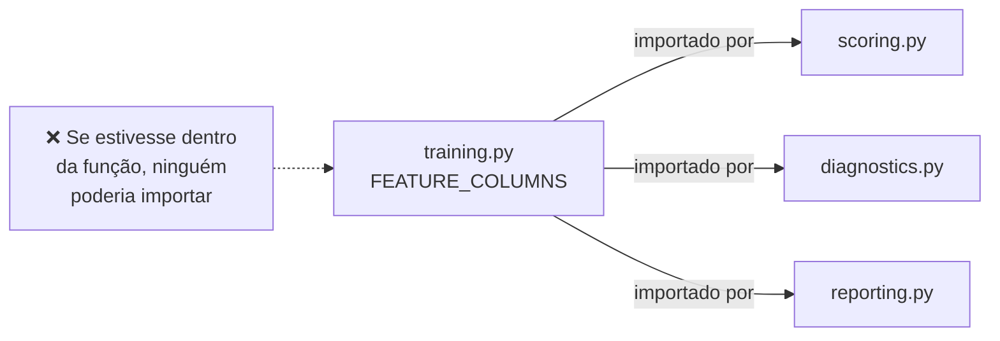

### 5.2 Validação de schema antes de treinar

```python
missing = [c for c in (FEATURE_COLUMNS + [TARGET_COLUMN]) if c not in df.columns]
if missing:
    raise ValueError(f"Missing required columns in {finaldata_path}: {missing}")
```

Valide sempre na fronteira de entrada. Se o CSV vier com colunas erradas, o erro
aparece aqui com mensagem clara — e não no meio de um traceback de NumPy.

### 5.3 Parâmetros do modelo

```python
model = LogisticRegression(solver="liblinear", random_state=0, max_iter=1000)
```

| Parâmetro | Motivo |
|---|---|
| `random_state=0` | reprodutibilidade — mesmo resultado toda vez |
| `solver="liblinear"` | adequado para datasets pequenos |
| `max_iter=1000` | evita `ConvergenceWarning` em dados não-lineares |

> **Regra de ouro:** sempre fixe `random_state`. Um modelo que retreina toda noite e
> produz F1 aleatório é impossível de monitorar.

### 5.4 Persistência segura com pickle

```python
# ✅ with garante fechamento mesmo em caso de erro
with model_path.open("wb") as file:
    pickle.dump(model, file)

# ❌ Não faça isso — arquivo pode ficar aberto em caso de exceção
pickle.dump(model, open(model_path, "wb"))
```

---

## 6. `scoring.py` — Avaliação

**Responsabilidade:** carregar modelo treinado, prever no conjunto de teste,
calcular F1, gravar `latestscore.txt`.

### 6.1 Por que F1 e não acurácia

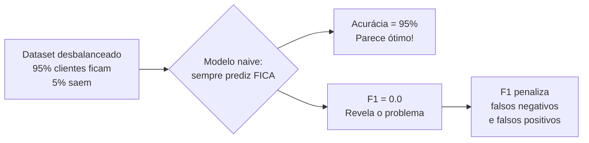

F1 é a métrica certa para classificação com classes desbalanceadas.

### 6.2 Escrita canônica do score

```python
score_path.write_text(f"{score}\n", encoding="utf-8")
```

- `float(f1_score(...))` — converte `numpy.float64` para `float` nativo antes
  de gravar.
- `encoding="utf-8"` explícito — evita surpresas em servidores com locale diferente.
- `\n` no final — convenção POSIX para arquivos de texto.

---

## 7. `deployment.py` — Deploy de artefatos

**Responsabilidade:** copiar (só copiar) `trainedmodel.pkl`, `latestscore.txt` e
`ingestedfiles.txt` para `production_deployment/`.

### 7.1 Deploy não retreina

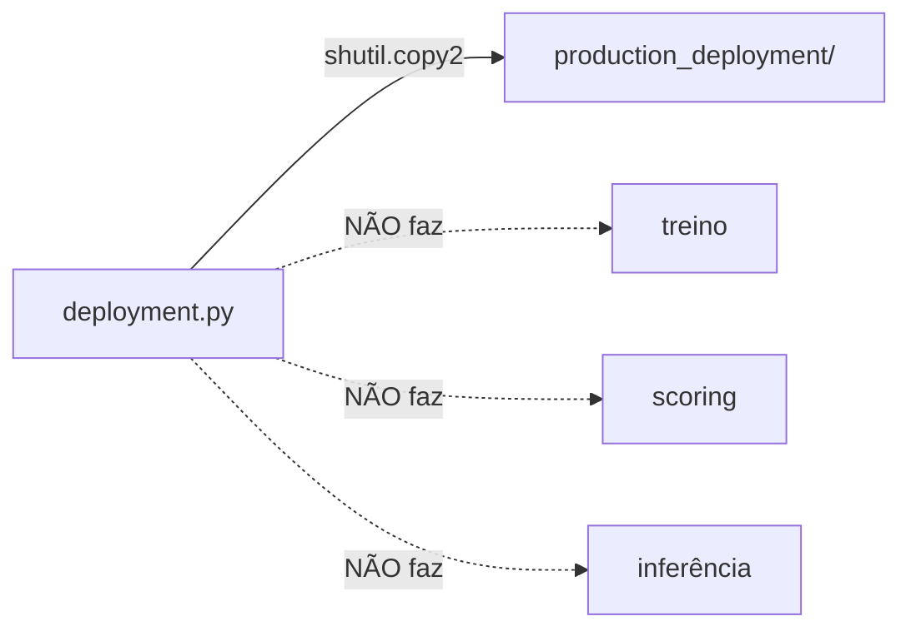

**Por que:** se `deployment.py` retreinasse, você perderia a capacidade de reverter
para a versão anterior. Deploy deve ser apenas "mover artefatos já validados para produção".

### 7.2 Validar tudo antes de agir

```python
# 1º loop: validar todos os arquivos antes de copiar qualquer coisa
for src in sources:
    if not src.exists():
        raise FileNotFoundError(f"Required artifact not found: {src}")

# 2º loop: só agora copia
for src in sources:
    shutil.copy2(src, prod_dir / src.name)
```

**Por que dois loops?** Se o terceiro arquivo não existir e você já copiou os dois
primeiros, `production_deployment/` fica em estado inconsistente (modelo novo +
score antigo). Validar tudo antes de agir evita esse problema.

---

## 8. `diagnostics.py` — Diagnóstico operacional

**Responsabilidade:** 5 funções de monitoramento do modelo em produção.

### 8.1 As 5 funções e o que monitoram

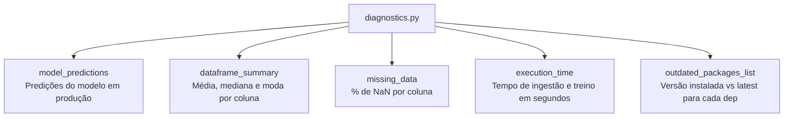

### 8.2 `model_predictions` usa o modelo de *produção*

```python
# Lê de production_deployment/ — não de models/
prod_dir = project_dir / config["prod_deployment_path"]
model_path = prod_dir / "trainedmodel.pkl"
```

Isso é intencional. O endpoint `/prediction` deve refletir o que está **em produção**,
não o último modelo treinado (que pode ainda não ter sido validado para deploy).

### 8.3 `dataframe_summary` — média, mediana e **moda**

```python
mode_series = series.mode(dropna=True)
mode_value = float(mode_series.iloc[0]) if not mode_series.empty else float("nan")
summary.extend([float(series.mean()), float(series.median()), mode_value])
```

> **Cuidado com `.mode()`:** retorna uma `Series` (pode haver múltiplas modas).
> Usar `iloc[0]` é uma decisão de design — pegamos a primeira. O importante é
> ser determinístico.

### 8.4 `execution_time` — `perf_counter` vs `time`

```python
start = time.perf_counter()
subprocess.run([python_exe, script_name], check=True)
return float(time.perf_counter() - start)
```

| Função | Problema |
|---|---|
| `time.time()` | pode "retroceder" (ajuste NTP, mudança de fuso) |
| `time.perf_counter()` | monotônico — sempre avança, ideal para medir duração |

### 8.5 Por que `sys.executable` e não `"python"`

```python
python_exe = sys.executable  # ex: /home/.../workspace_local/.venv/bin/python
subprocess.run([python_exe, script_name], ...)
```

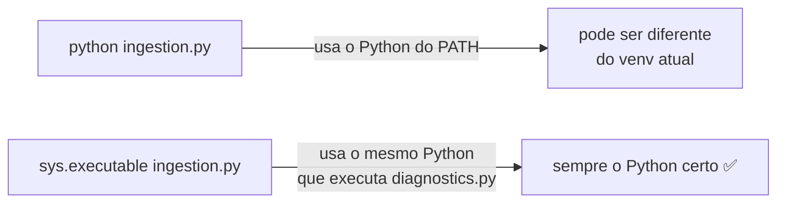

---

## 9. `reporting.py` — Relatórios

**Responsabilidade:** gerar `confusionmatrix.png` e (opcionalmente) `report.pdf`.

### 9.1 Por que passar `labels=[0, 1]` explicitamente

```python
matrix = confusion_matrix(y_true, y_pred, labels=[0, 1])
```

```mermaid
flowchart LR
    A["y_true = [1, 1, 1]\nApenas classe 1 no batch"] -->|sem labels| B["confusion_matrix\nretorna matriz 1x1\n heatmap quebra ❌"]
    A -->|com labels=[0,1]| C["confusion_matrix\nretorna matriz 2x2\n sempre correto ✅"]
```

### 9.2 Cuidados de visualização

```python
sns.heatmap(matrix, annot=True, fmt="d", cmap="Blues", cbar=False)
plt.close()  # ← crítico em loops ou servidores
```

- `fmt="d"` — inteiros no heatmap (sem notação científica).
- `cmap="Blues"` — acessível para daltônicos.
- `plt.close()` — libera a figura da memória. Esquecer isso em código que gera
  muitos gráficos causa vazamento de memória.

---

## 10. `app.py` — API Flask

**Responsabilidade:** expor 4 endpoints REST para consumo automatizado dos resultados.

### 10.1 Application Factory Pattern

```python
# ✅ Factory — recomendado
def create_app() -> Flask:
    app = Flask(__name__)
    ...
    return app

# ❌ Global — evite em código de produção
app = Flask(__name__)
```

**Por que factory:**

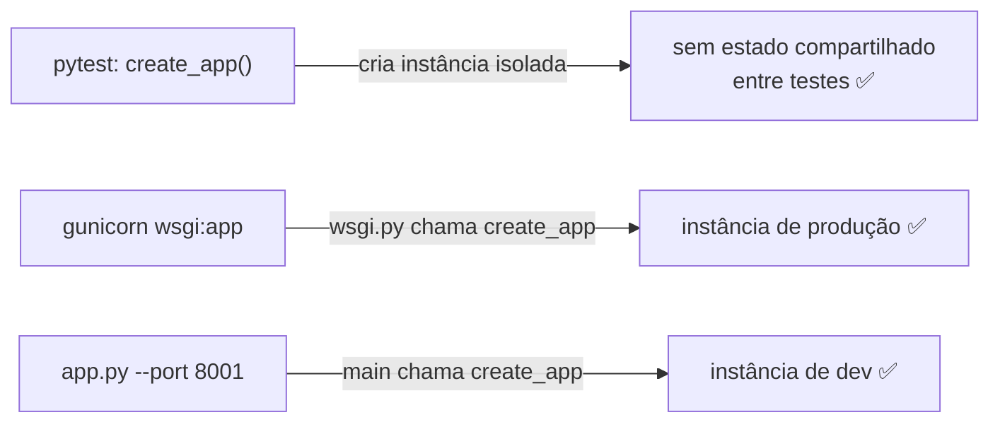

### 10.2 Os 4 endpoints obrigatórios

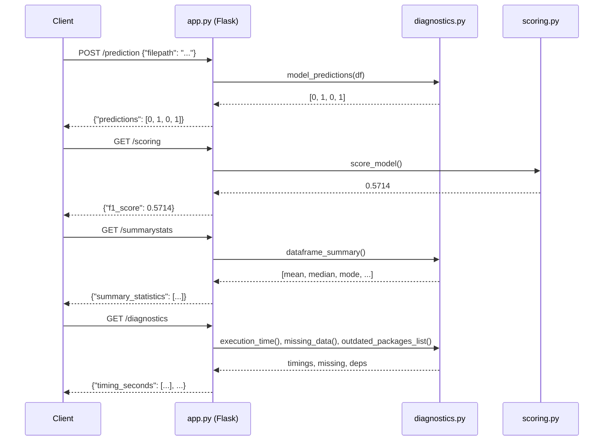

### 10.3 HTTP 200 em todos os endpoints — incluindo erros

```python
if not filepath:
    return jsonify({"error": "Missing required JSON field: filepath"}), 200
```

> Isso viola as convenções REST (onde falta de campo → 400). Mas é o que a rubrica
> pede. Em projetos reais, use os status HTTP corretos (400, 404, 500).

---

## 11. `apicalls.py` — Cliente da API

**Responsabilidade:** chamar os 4 endpoints e gravar as respostas em `apireturns.txt`.

### 11.1 Auto-start da API

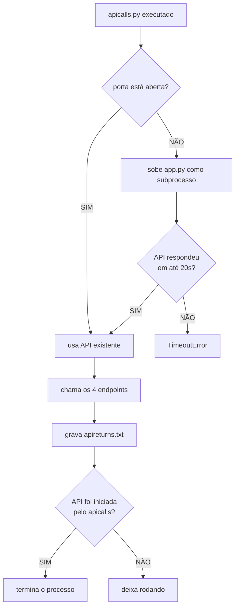

### 11.2 `try/finally` para recursos externos

```python
api_process = None
try:
    api_process = _start_api(...)
    responses = call_api_endpoints(...)
    write_api_returns(output_path, responses)
finally:
    _stop_api(api_process)  # sempre executa — mesmo se houver exceção
```

**Regra:** qualquer recurso externo (processo, arquivo, conexão) deve ser
liberado no `finally`. Sem isso, processos órfãos ficam rodando em background.

---

## 12. `fullprocess.py` — Orquestrador

**Responsabilidade:** automatizar o ciclo completo de retreino, avaliação e redeploy.
Executado pelo `cron` a cada 10 minutos.

### 12.1 Fluxo detalhado do gate de deploy

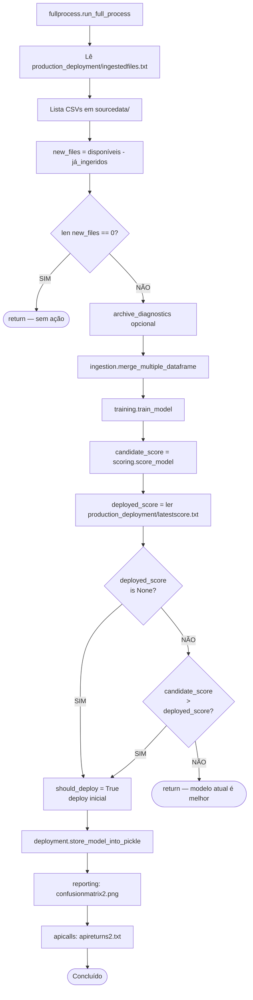

### 12.2 Por que verificar nomes de arquivo e não conteúdo

```python
already_ingested = _read_ingested_files(prod_dir / "ingestedfiles.txt")
available = _list_csv_filenames(input_dir)
new_files = sorted(list(available - already_ingested))
```

Comparar nomes é simples e funciona para o escopo do projeto. Em produção real,
você compararia hashes SHA-256:

```
# Produção real: hash do conteúdo
hash_a = sha256(file_a.read_bytes()).hexdigest()
# Detecta: mesmo nome, conteúdo diferente ← rubrica não detecta isso
```

Para este projeto, a abordagem por nome é suficiente e é o que a rubrica avalia.

---

## 13. `dbsetup.py` — Persistência SQLite

**Responsabilidade (standout #3):** guardar histórico de runs em banco SQLite.

### 13.1 Por que SQLite e não CSV de histórico

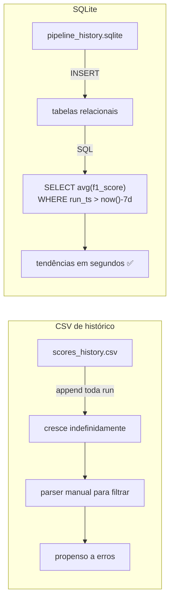

### 13.2 Schema — decisões de design

```sql
CREATE TABLE IF NOT EXISTS model_scores (
    id      INTEGER PRIMARY KEY AUTOINCREMENT,
    run_ts  TEXT    NOT NULL DEFAULT (datetime('now')),
    f1_score REAL   NOT NULL,
    source  TEXT    NOT NULL DEFAULT 'scoring'
);
```

| Detalhe | Motivo |
|---|---|
| `IF NOT EXISTS` | `init_db()` é idempotente — rodar duas vezes não quebra |
| `DEFAULT (datetime('now'))` | timestamp automático, sem passar manualmente |
| `NOT NULL` em `f1_score` | não admite registro sem métrica — a razão de existir |
| `sqlite3.Row` como row_factory | acessa `row["f1_score"]` em vez de `row[1]` |

---

## 14. Testes automatizados

### 14.1 Estratégia de testes herméticos

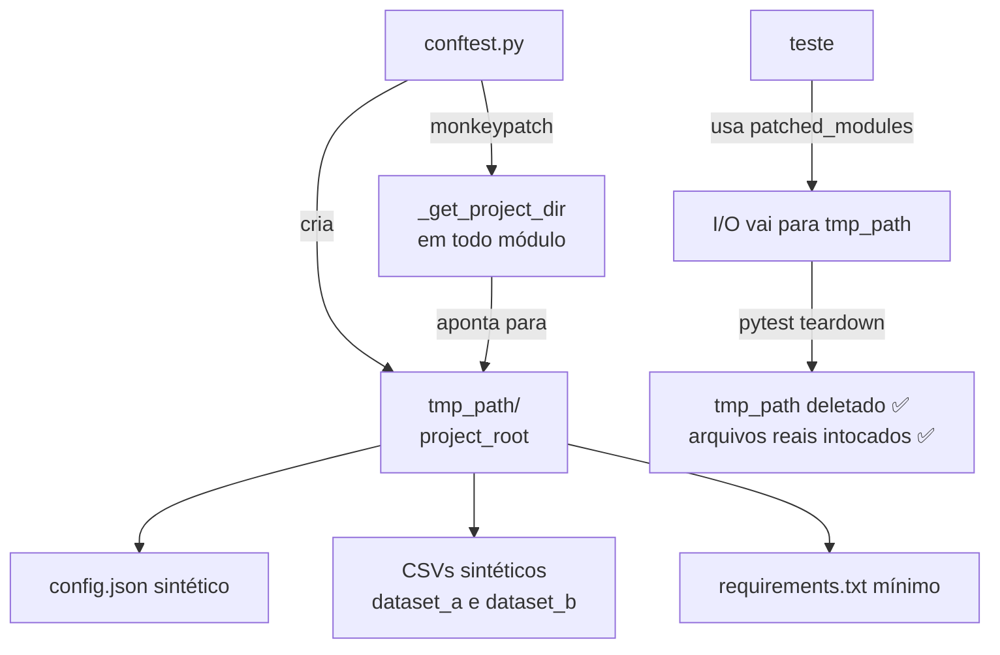

**Princípio:** cada teste monta seu próprio "projeto" em memória temporária.
Quando o teste termina, tudo é descartado automaticamente. Os arquivos reais
(`ingesteddata/`, `models/`) nunca são tocados.

### 14.2 Lição aprendida durante o desenvolvimento

Durante o desenvolvimento deste projeto, um bug de vazamento de teste foi encontrado:
`dbsetup._get_project_dir` e `archive_diagnostics._get_project_dir` não estavam sendo
substituídos pelo monkeypatch — e os testes gravavam arquivos no disco real.

```python
# conftest.py — todos os módulos que fazem I/O precisam estar aqui
for module in (ingestion, training, scoring, deployment,
               diagnostics, reporting, app_module, fullprocess,
               archive_diagnostics, dbsetup):          # ← esses dois foram adicionados depois
    monkeypatch.setattr(module, "_get_project_dir", lambda root=project_root: root)
```

**Moral:** qualquer módulo que faz I/O no disco precisa expor `_get_project_dir`
e estar incluído no fixture de patch.

### 14.3 Testes de fullprocess — o que cobrir

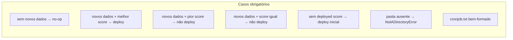

---

## 15. Checklist de boas práticas

Use esta lista como **self-review** nos seus próximos projetos:

- [ ] Caminhos em `config.json`, nunca hard-coded
- [ ] `pathlib.Path`, não `os.path.join`
- [ ] `logging` em vez de `print`
- [ ] `argparse` em todo script executável
- [ ] Type hints em todas as funções públicas (`-> List[str]`, `-> float`)
- [ ] Docstring em cada função pública (o que lê, o que escreve, o que retorna)
- [ ] Validação de schema na entrada de dados externos
- [ ] `random_state` fixado em tudo que usa aleatoriedade
- [ ] `with ... open()` para todo I/O de arquivo
- [ ] `try/finally` para recursos externos (subprocesso, conexão, socket)
- [ ] Testes com `tmp_path` e monkeypatch — nunca tocam disco real
- [ ] `_get_project_dir()` helper em todo módulo com I/O
- [ ] Application Factory (`create_app()`) em APIs Flask
- [ ] Validar tudo antes de agir (dois loops em deployment.py)
- [ ] `candidate > deployed` como critério de redeploy (nunca `!=`)
- [ ] Hooks opcionais em `try/except` defensivo (nunca quebram o pipeline principal)

---

## 16. Exercícios propostos

Esses exercícios ajudam a fixar os conceitos deste review:

**Exercício 1 — Schema centralizado**
Crie um arquivo `schema.py` com `FEATURE_COLUMNS` e `TARGET_COLUMN`. Importe
em todos os módulos que precisam dessas constantes. Rode os testes e confirme
que tudo passa.

**Exercício 2 — Threshold configurável de drift**
Em `fullprocess.py`, em vez de `candidate > deployed` puro, adicione um campo
`"drift_threshold": 0.02` no `config.json`. O deploy só ocorre quando
`candidate - deployed > drift_threshold`. Escreva um teste para os três casos:
abaixo do threshold, exatamente no threshold e acima.

**Exercício 3 — Hash de conteúdo**
Substitua a comparação por nome de arquivo em `fullprocess.py` por uma
comparação de hash SHA-256. Escreva um teste que simule: (a) arquivo renomeado
mas conteúdo idêntico → não é "novo"; (b) mesmo nome, conteúdo diferente
→ é "novo".

**Exercício 4 — Dashboard de tendências**
Usando o banco SQLite do `dbsetup.py`, escreva um script `trend.py` que lê a
tabela `model_scores` e plota um gráfico de linha do F1 ao longo do tempo usando
`matplotlib`. Mostre uma linha tracejada no F1 mínimo aceitável (ex: 0.5).

**Exercício 5 — Endpoint de health check**
Adicione um endpoint `GET /healthz` no `app.py` que retorna
`{"status": "ok", "model_loaded": true/false}` verificando se o modelo existe
em `production_deployment/`. Adicione um teste em `test_app.py`.

---

> **Fechamento**
>
> O que distingue um cientista de dados júnior de um sênior não é o conhecimento
> de algoritmos sofisticados — é a disciplina de escrever código que funciona às
> 3 da manhã quando o cron dispara, quando outra pessoa precisa modificar, quando
> o ambiente muda. Cada padrão deste review existe para atender exatamente essa
> disciplina.
>
> Incorpore um padrão de cada vez. Em seis meses, seu código será irreconhecível
> — para melhor.

---

*Documento gerado em 2026-04-21 — Dynamic Risk Assessment System (Udacity MLOps)*
