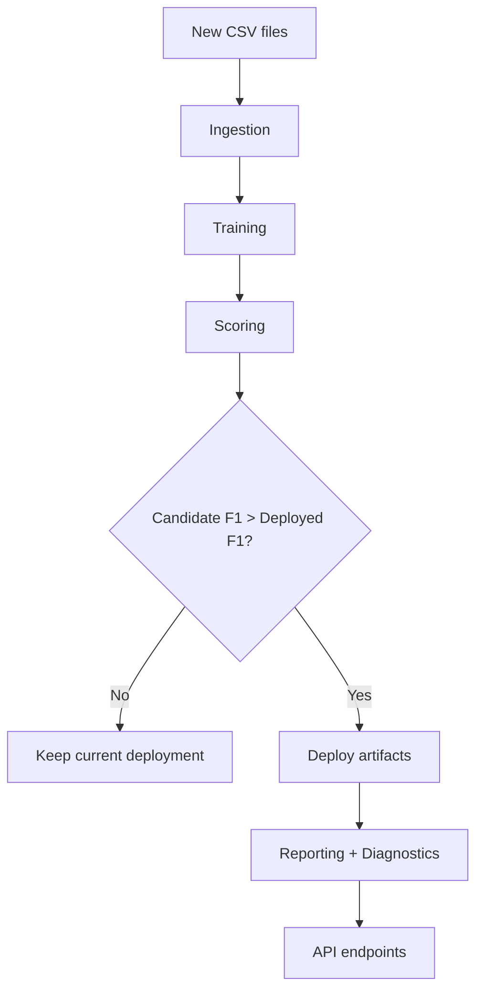

# Architecture

## System overview (plain language)

This system watches for new customer activity data, retrains a churn-risk model when needed, and publishes updated predictions and diagnostics through an API.

Think of it as an automatic quality-control loop for a machine learning model:
1. collect new data
2. retrain and evaluate
3. deploy only if performance improves
4. monitor and report

## Technical flow

1. **Ingestion**: merge all input CSV files and store canonical dataset.
2. **Training**: fit a logistic regression model on numeric activity features.
3. **Scoring**: compute F1 on held-out test data.
4. **Deployment**: copy approved artifacts to production deployment folder.
5. **Diagnostics**: expose summary stats, missingness, timing, and package status.
6. **Reporting**: generate confusion matrix and optional PDF report.
7. **Automation**: `fullprocess.py` checks for new files and redeploys only when candidate F1 exceeds deployed F1.

## Architecture diagram

## Design choices

- **Config-driven paths**: all folders and artifacts are controlled by JSON config.
- **File-based contracts**: each step writes explicit outputs for traceability and easy debugging.
- **Idempotent scripts**: repeat runs overwrite expected artifacts safely.
- **Deployment gating**: prevents unnecessary or regressive model replacements.

## Evolution path

This repository keeps the validated Udacity-compatible implementation in `workspace_local/`, while introducing root-level portfolio scaffolding (`src/`, `configs/`, `reports/`) for a clean public version.
